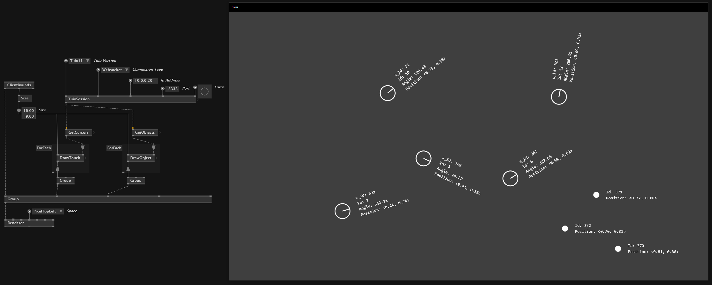
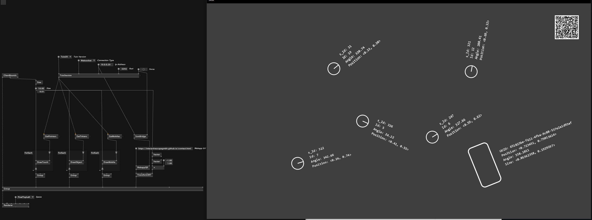

# VL.TUIO

Tuio Library for vvvv gamma, based on [Tuio.Net](https://github.com/InteractiveScapeGmbH/TuioNet).

Supports:
- Tuio 1.1
- Tuio 2.0
- Scape X Mobile

over:
- UDP
- Websocket

## Tuio 1.1

## Tuio 2.0

## Scape X Mobile

- scan the QR-Code which leads you to our [test-webapp](https://interactivescapegmbh.github.io) for Scape X Mobile.
- Press `Test Room`. (accept access to your gyroscope if asked)
- Put your phone on the table. It should get a unique id.

